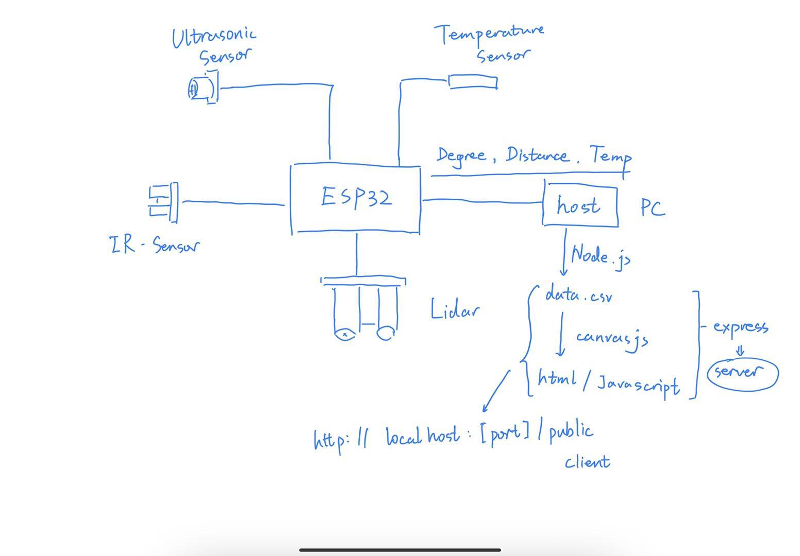
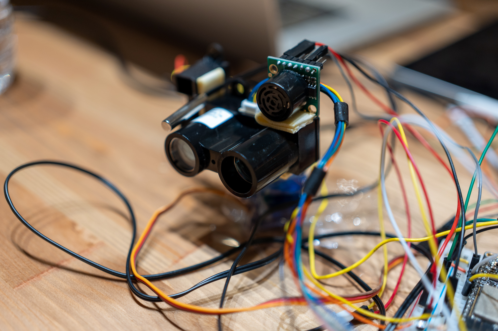

# Sonar
Authors: Qi Luo, Yihe Bi, Zhenglei Jiang

Date: 2022-10-11
-----

## Summary
All sensors including ultrasonic, IR, lidar, and thermistor are mounted on servo. Lidar sensor is connected through I2C port, and other sensors are connected to ADC1_6, 3, 0 respectively to the esp32 chip. Then the data will be sent through USB serialport to host. The host will read in the data and write it to a csv file. That file is then be sent and rendered by canvas js. The clint can see the rendered chart through http in real time.

## Self-Assessment

### Objective Criteria

| Objective Criterion | Rating | Max Value  | 
|---------------------------------------------|:-----------:|:---------:|
|  Periodic reporting of ultrasonic range in m | 1 |  1     | 
| Periodic reporting of IR range in m | 1 |  1     | 
| Periodic reporting of temperature in m | 1 |  1     | 
| Results displayed at host as text | 1 |  1     | 
| Results graphed at host continuously based on reporting period with ultrasonic sensor mounted on servo| 1 |  1     | 
| Demo delivered at scheduled time| NA |  1     | 
| Investigative question response |1 |  1     | 

### Qualitative Criteria

| Qualitative Criterion | Rating | Max Value  | 
|---------------------------------------------|:-----------:|:---------:|
| Quality of solution | 4 |  5     | 
| Quality of report.md including use of graphics | 3 |  3     | 
| Quality of code reporting | 3 |  3     | 
| Quality of video presentation | 3 |  3     | 

## Solution Design

  

## Response to Investigative Question
IR sensor is more accurate and has quicker response than the ultrasonic sensor. The ultrasonic sensor tends to occationally have values that are not reasonable. However, lider is much more accurate than the other two. If price differerce between them is not significant, I will use lidar on a self driving car. If lidar is more expensive, I will use IR sensor around the car and one or two lidar on the car.

## Sketches and Photos

  

  

  

 

## Supporting Artifacts
- [Link to video demo](https://drive.google.com/file/d/1XbwP4bUNTsVdKFgj8nYKfOR1jUggfCfr/view?usp=sharing).

## Modules, Tools, Source Used Including Attribution
https://canvasjs.com

https://blog.shahednasser.com/how-to-read-and-write-csv-files-using-node-js-and-express/

ADC1 Example https://github.com/espressif/esp-idf/tree/39f090a4f1dee4e325f8109d880bf3627034d839/examples/peripherals/adc

## References
Lidar doc https://static.garmin.com/pumac/LIDAR_Lite_v3_Operation_Manual_and_Technical_Specifications.pdf

Thermistor https://learn.adafruit.com/thermistor/using-a-thermistor

IR Rangefinder https://www.sparkfun.com/datasheets/Sensors/Infrared/gp2y0a02yk_e.pdf

Ultrasonic Distance Sensor https://www.maxbotix.com/documents/HRLV-MaxSonar-EZ_Datasheet.pdf

-----

