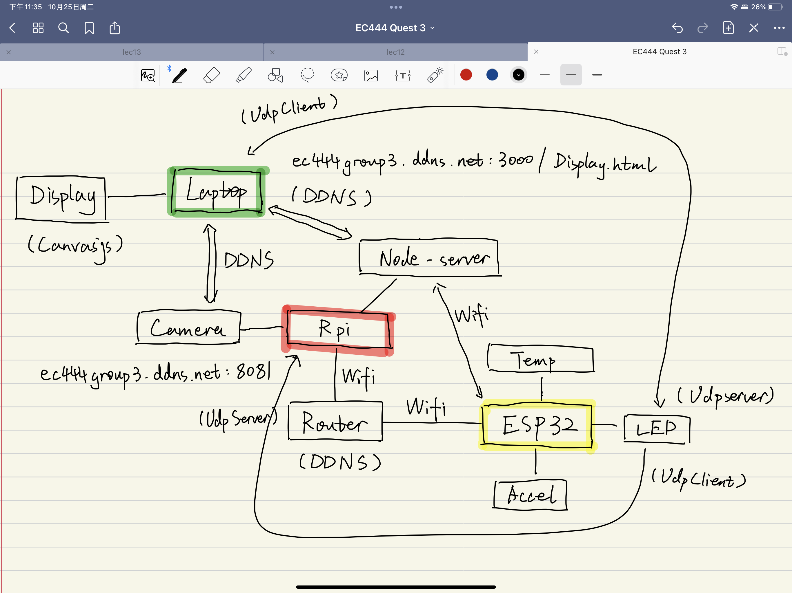

# Quest Name
Authors: Nan Jiang, Qi Luo, Yihe Bi

Date: 2022-10-25
-----

## Summary

## Self-Assessment

### Objective Criteria

| Objective Criterion | Rating | Max Value  | 
|---------------------------------------------|:-----------:|:---------:|
| Measure acceleration, temperature, and battery level | 1 |  1     | 
| Displays real-time data(temperature, cibration, battery level) at remote client via portal using seperate IP network| 1 |  1     | 
| Control LED on box from remote clinet via portal | 1 |  1     | 
| Sources web cam video into remote client | 1 |  1     | 
| ESP32 and Rpi are connected wirelessly to router; ESP32 sensor data are delivered to local node server (on local laptop or Rpi) | 1 |  1     | 
| Demo delivered at scheduled time and report submitted in team folder with all required components | 1 |  1     | 
| Investigative question response | 1 |  1     | 

### Qualitative Criteria

| Qualitative Criterion | Rating | Max Value  | 
|---------------------------------------------|:-----------:|:---------:|
| Quality of solution | 4 |  5     |  
| Quality of report.md including use of graphics | 3 |  3     | 
| Quality of code reporting | 3 |  3     | 
| Quality of video presentation | 3 |  3     | 

## Solution Design
As shown in the graph, our design mainly have 3 parts. The Raspberrypi, ESP32, and the laptop for display. The ESP32 is conneted to LEP using GPIO pin 13, and to temp sensor using ADC pin, and Accel using SCL and SCP.
ESP32 use Wifi to connect to the router. It takes in data from the laptop (ESP32 as Server, Laptop as Server) to control the LED intensity. It also send data into Rpi (ESP32 as Client, Rpi as Server).
In Rpi, data is parsed and stored in csv file. Then, we use three html file to display all of the data using canvasjs. Then, we run a server to upload all the files so it is accessible from the laptop. It also use motion packege to run the camera and upload the footage.
On our laptop, we can access the camera from ec444group3.ddns.net:8081, and the canvajs display in html files in ec444group3.ddns.net:3000/Display.html. Details are in our DDNS group skill report.

## Sketches and Photos

 

## Investigative Question

What are steps you can take to make your device and system low power?
- Scheduling:\
Create a scheduling system that only wakes sensors and network devices at a designated time, or when the user calls, to reduce system idle and eliminate unnecessary idle power consumption.
- Reduce Sensor Measurement Frequency:\
modify sensor code so that sensors measure minium data required for the project to reduce unnecessary power consumption.
- Reduce Data Transmittion Power Consumption (WiFi):\
Replace Wi-Fi with a direct LAN connection （or Bluetooth LE + some internet device） to reduce the unnecessarily high power consumption of Wi-Fi wireless transmission.

## Supporting Artifacts
- [Link to video demo](https://drive.google.com/file/d/1ns4iCg6crqZgcCLw4OLpqSZj30X-Yftb/view?usp=sharing).

## Modules, Tools, Source Used Including Attribution

## References
Reference for improving power effeciency: https://www.bytesnap.com/news-blog/microcontroller-design-optimising-power-consumption-12-easy-steps/
-----

