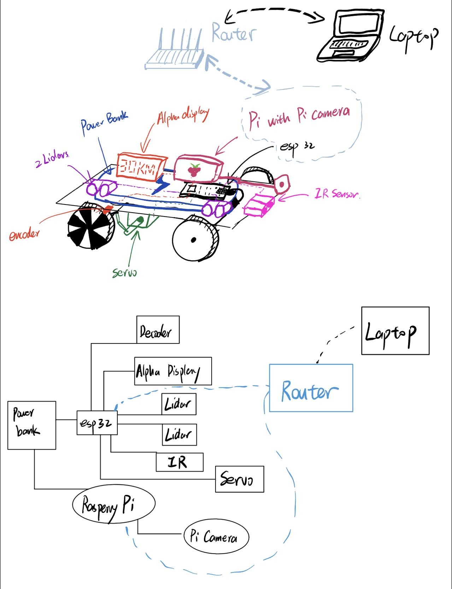

# Cruise and Remote Control
Authors: Qi Luo, Zhenglei(Nan) Jiang, Yihe Bi

Date: 2022-11-11
-----

## Summary
In this quest we programed a autonomus driving car wiht tele control from laptop command and added multiple Lidar sensors, camera based on rasperary pie, and range sensor to achieve multi sensor driving. A optical solution is added to calculate car spped with encoder pattern. In addition, we implemented a basic PID control using micro to better control the car's motion.

## Self-Assessment

### Objective Criteria

| Objective Criterion | Rating | Max Value  | 
|---------------------------------------------|:-----------:|:---------:|
| Control Steering of the car to maintaining center of course (+/- 25m) | 1 |  1     | 
| use PID control for maintaining fixed speed setpoing in the range of [0.1-0.4m/s] after start and before stop  | 1 |  1     | 
| Stop within 20 cm of end of track without collision | 1 |  1     | 
| Star and stop instrucitons be issued through wireless control | 1 |  1     | 
| Display speed & Distance info on alpha display | 1 |  1     | 

### Qualitative Criteria

| Qualitative Criterion | Rating | Max Value  | 
|---------------------------------------------|:-----------:|:---------:|
| Quality of solution | 5 |  5     | 
| Quality of report.md including use of graphics | 3 |  3     | 
| Quality of code reporting | 3 |  3     | 
| Quality of video presentation | 3 |  3     | 

## Solution Design
Our solution mainly contains 2 parts. 1. The mechanical interfaces and 2. Back-ends functions. 

All the mechanical parts on the buggy controlled by ESP32 and Raspberry Pi. The display and LiDARs are connected to ESP32 using I2C. We assigned different addresses to each lidars. We use GPIO to control and receive information from the decoder. We use ADC to control the IR-sensor. Also, we wired up the ESP32 to the ESC and Steering Servo as the graph shown below. We use PWM to steer and start the buggy.

As for backend, we have data from multiple sensors. The IR-sensor is for emergency stop. So, if the distance is below a certain value for two consecutive samples, the buggy will be forced to stop. The two LiDAR use PID to steering to buggy so that it would go along a wall at about 30 cm. The benefit of having two LiDAR is shown in the graph. Besides, we use decoder to read the speed of the buggy, and use PID to stable the speed at about 0.5m/s.

For the frontend, we write a html file to control the buggy from browser. The browser communicated with a .js file in backend using XmlHttpRequest. The .js file is both a Server to receive the reqeust, and also a udp client to send the command to ESP32 which is running an udp server. We also integrated the Rpi Web-cam video into this web page.

We are very proud of our creation this time! 

## Sketches and Photos

 

 

 

## Supporting Artifacts
- [Link to video demo](https://drive.google.com/file/d/134oLKh67IdZDi4GJCTnGKfsI4sO9HOgP/view?usp=sharing). Not to exceed 120s

## Modules, Tools, Source Used Including Attribution

## References
https://github.com/BU-EC444/bu-ec444-whizzer/blob/Fall-2022/quests/primary/cruise-control.md
-----

