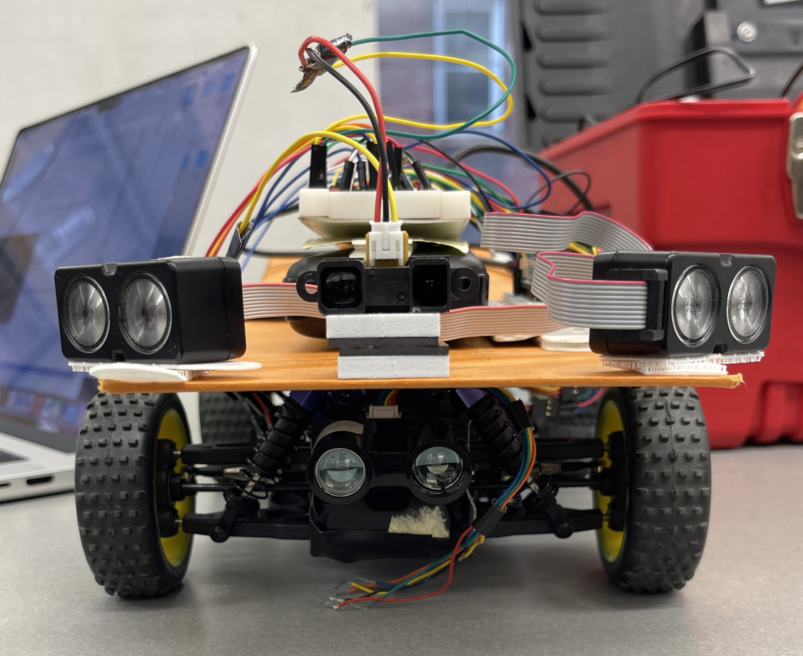

# AI Driver
Authors: Yihe Bi, Qi Luo, Zhenglei(Nan) Jiang

Date: 2022-02-12
-----

## Summary
In this quest, we rebuild the buggy to suit new requirements. The raspbarry pi and camera were removed, the two lidar sensors are mounted to new front 30 degree position and IR sesnsor now enables car emergency stop. With onborad ESP-32, the buggy is capable of autonomous steering and emergency stop with the data colelcted by above mentioned sensors.

## Self-Assessment

### Objective Criteria

| Objective Criterion | Rating | Max Value  | 
|---------------------------------------------|:-----------:|:---------:|
| Steers to maintain course +/- 25 cm | 1 |  1     | 
| Stop by obstacle safely, continues afterwards once obstacle is removed | 1 |  1     | 
| Complete track witnin 2 minutes | 1 |  1     | 
| Handle one left turn | 1 |  1     | 
| Handle one right turn | 1 |  1     | 
| On-device computation | 1 |  1     | 
| Demo | 1 |  1     | 

### Qualitative Criteria

| Qualitative Criterion | Rating | Max Value  | 
|---------------------------------------------|:-----------:|:---------:|
| Quality of solution | 4 |  5     | 
| Quality of report.md including use of graphics | 3 |  3     | 
| Quality of code reporting | 3 |  3     | 
| Quality of video presentation | 3 |  3     | 

## Solution Design
In this quest, we rebuild the buggy to suit new requirments. It now has a front facing IR-sensor, 2 lidars and decoder.

### Set up
The first attached picture is our Setup. On the front, we have an IR sensor to trigger emergency stop. On the left and right we have two lidars v4 facing about 30 degree sideways from the center. They are collecting information for steering. At the buttom there is a lidar v3. It might cause issue if we connect it to i2c, so we eventually dicided not to use it.

### Technical Detail

#### Data Collecting
We collected the IR, Lidar, and decoder data using the ESP32. Instead of using serial port to communicate with the the laptop, we use udp to send data (That's because formatting the console log is pretty hard given that we have so many hardwares running) and store it in a .csv file. We then import this file to matlab, and fit the result to a curve. We treated the lidar and IR separtely to reduce the complexity in the model. Then, we embedded the model into our ESP32 codes to control the buggy.

#### Steering
As we mentioned in the Data Collecting part, we created a curve to model the steering and lidar data. In order to approach that curve, we use PID to control the steering. Eventually, after endless calibration, we achieved the ideal performance.

#### Emergency Stop
Similar to steering, we created a curve to model the stop and IR data. However, because this model is less complicated (linear), we just set if the IR takes in a consecutive set of data that exceed an amount, the buggy will just stop. On the other hand, if it reads in a consecutive set of data that lower than that amount, the buggy will continue.

## Sketches and Photos

 

## Supporting Artifacts
- [Link to video demo](https://drive.google.com/file/d/1hmt3ZyuySI84e6wIrInLbMq1GJoCnlER/view?usp=sharing). Not to exceed 120s

## Modules, Tools, Source Used Including Attribution
https://github.com/BU-EC444/bu-ec444-whizzer/blob/Fall-2022/quests/primary/neuralcar.md

## References

-----

